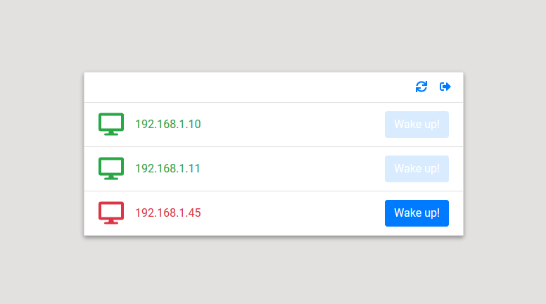

# home-wake-on-lan



Quick app made for home usage.

Allow you to ping devices on the network and send wake on lan request to compatible ones.

### Prerequisites

[Nodejs](https://nodejs.org/en/) required for server side

Client side can be used on any http server

### Installing

__Server__

* Rename the configuration file to conf.js and edit it.
```
npm install
```
* Launch server.js with nodejs (Better use [PM2](http://pm2.keymetrics.io/) to manage the process)

__Client__

* Rename the configuration file to conf.tsx and edit it.
```
npm install
```
```
npm run build
```
* host the client on a web server

### Made With

__Server__
* [Nodejs](https://nodejs.org/en/)

__Client__
* [React](https://reactjs.org/)
* [React Bootstrap](https://react-bootstrap.github.io/)

### License

This project is licensed under the MIT License - see the [LICENSE.md](LICENSE.md) file for details
